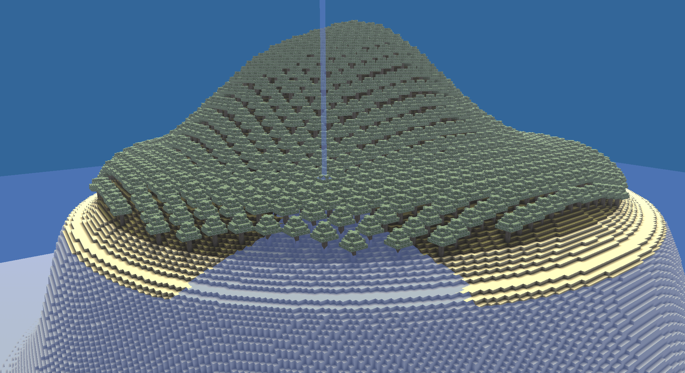
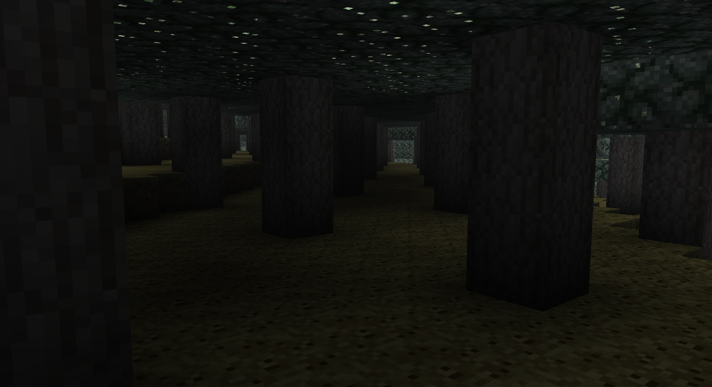
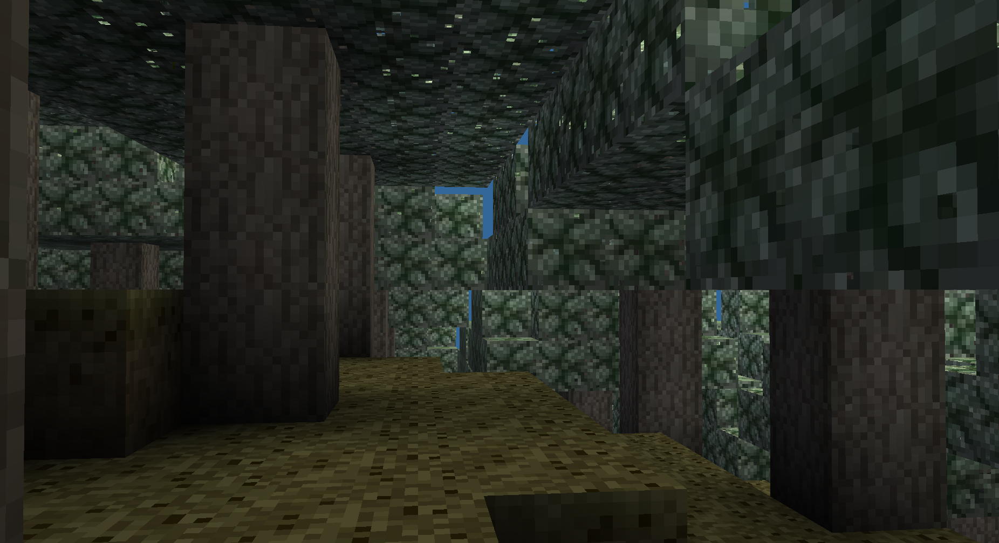

# VoxelNow

This is a "simple" project that I made recreating the bases of minecraft, it doesn't have the avility to destroy blocks or water but it could be done esly. It is made entirely in c# and uses OpenTK as a bridge to OpenGL. 
The game has a mod system that loads in runtime mod assemblies made with the API.

## Features

Water rendering and phyisics. Water slides down the hill.

Shadows and ambient oclussion. Shadows propagate.

